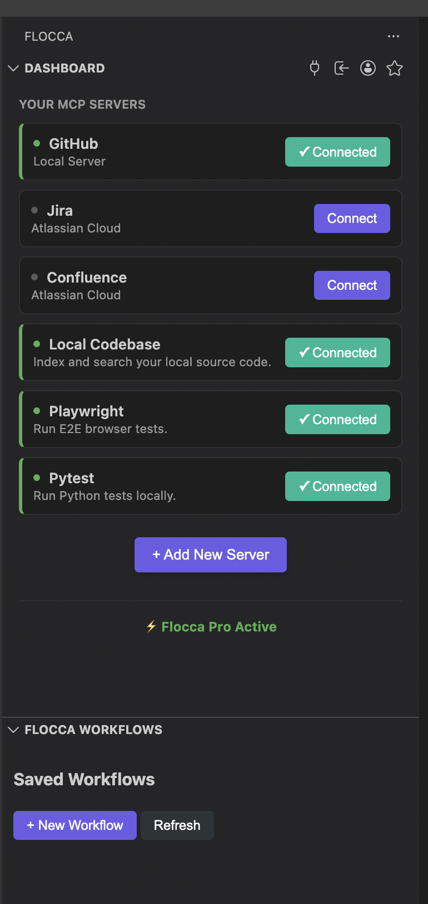

# Flocca - Connect MCP Servers in VS Code

**Connect MCP servers in VS Code to run workflows across Jira, GitHub, cloud, QA, and DevOps tools from one dashboard.**

Flocca helps teams connect their apps through MCP so AI agents can run real workflows securely from the IDE.

Use Flocca to:
* Read and update Jira work items.
* Search and manage GitHub repositories.
* Run testing workflows with Playwright and Pytest.
* Work across cloud and infrastructure tools.
* Keep credentials managed securely.

## Key Features

* **Connect MCP servers in one place**: Manage integrations directly in the Flocca sidebar.
* **MCP-native**: Built on the Model Context Protocol for interoperable agent tooling.
* **Secure credential handling**: Keep secrets out of source code and local config files.
* **Team and enterprise ready**: Role-based access and seat-based scaling support.
* **GitHub-first onboarding**: Fastest path to sign in and get started.

## Supported Integrations

* **Issue Tracking / PM**: Jira, Confluence, Zephyr
* **Source Control / CI**: GitHub, GitLab, Bitbucket, GitHub Actions
* **Cloud / Infra**: AWS, Azure, GCP, Kubernetes, Docker
* **Communication**: Slack, Microsoft Teams, Notion
* **Data / Observability**: PostgreSQL, Elasticsearch, Sentry
* **Testing / QA**: Cypress, Playwright, Pytest, TestRail

## Getting Started

1. **Install** the extension from the VS Code Marketplace.
2. **Open Flocca** from the Activity Bar.
3. **Sign in** (GitHub recommended for quickest setup).
4. **Connect your MCP servers** and start running workflows.

## Privacy and Security

* **Local-first runtime**: Flocca operates inside your IDE workflow.
* **Credential safety**: Avoid committing secrets like `.env`, `mcp.json`, or `.vscode` configs.
* **Open standard foundation**: Built around MCP.

---

[Website](https://flocca.app) | [Documentation](https://flocca.app/docs) | [Issues](https://github.com/neinHQ/flocca-vscode/issues)
